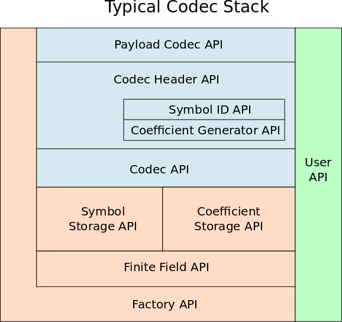

Hacking Kodo
============

The following information is meant for developers who need information
beyond what can be learned from reading the examples about how Kodo's
design and functionality.

Introduction
------------
With Kodo we wanted to build a library which allowed easy experimentation
with erasure correcting codes, in particular Network Codes. One of the
major challenges has been to produce a design which allowed experimentation
with variants of different codes, but without having to rewrite or duplicate
a lot of code. To support this we went through a large number of design
iterations e.g. using traditional polymorphic OO (Object Oriented) designs.
We have finally settled for using a special C++ design technique known as
mixin-layers or parametrized inheritance. Utilizing this technique has
made it possible to create a component based library with a high level
of code reuse.

In the following we will attempt to provide an overview of the Kodo design
and the current architecture. Along the way we will provide definitions of
the terminology we use throughout the library. The goal is that this
overview should be readable for an as wide as possible audience. Therefore
if you should find something missing, unclear or which could be improved
please let us know.

API Layer Specifications
------------------------
Although the mixin-layer technique provides many benefits in terms of reuse
and flexibility it also provides you with ample ways of shooting yourself
in the foot, by accidentally reordering layers in wrong ways or by not
having compatible layers in both encoders and decoders. Some of these
problems will be caught at compile time, but others can result in subtle
and hard to find errors at run time. You should therefore always pay close
attention when adding, removing or reordering layers in encoders and
decoders.

In an attempt to reduce the amount of problems that can arise from
misconfigured encoders and decoders we have created a set of API
specifications. These specifications state in which order layers
should be grouped and what functions (API) a specific layer should
implement. Since adherence to these specifications are not enforced
by the compiler or C++ itself. They require some discipline on behalf
of the developers. The following section will describe the specified API
layers and how they are typically used to build an error correcting
encoder or decoder.

Overview of Typical Codec Stack
-------------------------------
In the figure below you see what a typical codec stack looks like. The
APIs used at each layer is documented in our API Documentation (`Doxygen`_).
In this section we will briefly describe the functionality of each layer.
This should hopefully make it easier for developers to find the right
place to add new functionality and thereby also which API they should
implement.

When we say typical codec stack about the figure shown above it is
because you do not have to follow this structure. If for some reason
it makes sense for you to reorder the layers, this is entirely possible.
In Kodo however most existing codecs do follow the pattern shown in the
figure, and we encourage you to do the same in order to make the code as
easy to follow as possible.

API Layers
----------
In the following we will provide an overview of the purpose of each API
layer. The goal is to make it easier to figure out where to look for
specific functionality or where new functionality should be added.

You may find the exact API specifications in our `Doxygen`_ documentation.

.. _Doxygen: http://176.28.49.184:12344/doxygen/kodo

User API
~~~~~~~~
The User API are the functions which does not belong in any specific category.
This could be functions that are specific to debugging functionality or
similar. As indicated on the codec stack figure the user API can be implemented
anywhere in the stack depending on the desired functionality.

Payload Codec API
~~~~~~~~~~~~~~~~~
The payload codec API is the “user” API it provides a simply ``encode()``
and ``decode()`` API which either produces an encoded symbol into the
provided payload buffer or attempts to decode the symbol stored in the
payload buffer. Finally the payload layer is responsible for splitting
the payload buffer into the symbol data and symbol header.

As a developer you may choose to implement a Payload Codec layer if you
wish to implement functionality not requiring access to the memory of
the individual coded symbols. Example of this could be:

* Adding layer which overrides the ``decode()`` API to measure the time
  elapsed between to consecutive ``decode()`` calls. This would allow a
  developer to measure the time since a packet arrived for a specific
  decoder.
* The payload layer may also embed additional information into the payload
  buffer by overriding the payload_size() function. This is however often
  better implemented Codec Header layers.

Codec Header API
~~~~~~~~~~~~~~~~
The Codec Header API is typically invoke after the Payload Codec API has
split a payload buffer into the symbol data and the symbol header.
Depending on whether we are implementing an encoder or decoder we
typically use this layer to read or write information about the symbol
data into the symbol header.

As a developer you may choose to implement a Codec Header layer if you
for example:

* You wish to write information to the symbol header which can be used
  on by the decoder to optimize its performance.

The symbol header may be used to store a variety of different information
into a coded symbol. However the most important information stored at
this layer in the header is the symbol id.

Symbol ID API
~~~~~~~~~~~~~
The symbol id describes exactly how an encoded symbol was produced and
must therefore be available on the decoder side in order for the decoder
to be able to work on the symbol. In most cases this simply means that
the symbol id must uniquely describe the coding coefficients used to
produce encoded symbol. The symbol id can take many forms on the wire
depending on the variant chosen.

As a developer you may choose to implement a Symbol ID layer if you for
example:

* Wish to use a compression algorithm to send a compressed version of
  the coding coefficients to the receivers.

* Wish to send the seed used to generate the coefficients or an index
  into a generator matrix, instead of the actual coding coefficients.

Whatever representation is written the symbol id API will provide you
with the functionality to access both the generated id and the raw
coding coefficients. The raw coding coefficients are generated by the
coefficient generator API.

Coefficient Generator API
~~~~~~~~~~~~~~~~~~~~~~~~~
The coefficient generator API will generate the coding coefficients
used to produce an encoded symbol. Although this may seen as a small
insignificant task, it is actually in many cases one of the most
important aspects of a specific codec. In fact one of main differences
between many different Erasure Correcting Codes is the way coding
coefficients are generated.

As a developer you may choose to implement a Coefficient Generator
layer if as an example you wish to:

* Create a sparse code, where coding coefficients are chosen according
  to some specific distribution.

* Optimize the generation of coding coefficients based on e.g. feedback
  from the receiving users.

Codec API
~~~~~~~~~
This is one of the fundamental layers, the Codec API specifies the
functions needed when implementing a new encoder or decoder algorithm.
On the encoder side this is where encoded symbols are produced through
linear combinations of the original source symbols. On the decoder
side this is where the operations implemented by the encoder is reversed
producing the original source symbols.

As a developer you may choose to implement a Codec API layer if as an
example you wish to:

* Implement a special encoding or decoding algorithm.
* Do statistics over the encoded and decoded symbols and the performance
  of the algorithms.

Symbol Storage API
~~~~~~~~~~~~~~~~~~
The symbol storage API layers provide storage for the encoding and
decoding symbols. The symbol storage layers implement different
strategies for memory handling. As an example it is different layers
may provide pre-allocated storage for the encoders and decoders,
whereas other layers will require that the user of the encoders and
decoders provide the memory into which coding should be performed.

As a developer you may choose to implement a Symbol Storage layer
if you wish to:

* Implement monitoring of memory access by the encoding and decoding
  algorithms.
* Implement different symbol storage strategies.

Coefficient Storage API
~~~~~~~~~~~~~~~~~~~~~~~
Provides more or less the same functionality as the Symbol Storage API,
only difference being that here we deal with the coding coefficients
used to encode and decode the source symbols.

Finite Field API
~~~~~~~~~~~~~~~~
The finite field API layer provides a very important function in the
codec stack. Namely, the support of finite field mathematics. This is
a crucial component of an Erasure Correcting Code.

.. note: In most cases we rely on the fifi library for finite
   field arithmetic operations. Originally fifi was a part of
   Kodo, however it was split into two libraries mainly due to
   the fact that the finite field implementations, may be useful
   within other areas such a cryptograhy and signal processing.

As a developer you may choose to implement a Finite Field layer if you
wish to:

Implement new algorithms for computations in finite fields (however
you should consider whether this would fit better into the fiif library).
Implement statistics of the number of finite field operations.

Factory API
~~~~~~~~~~~
The factory API defines the functions responsible for constructing and
initializing a codec stack. All layers have access to the factory API,
which can be used to pre-allocated memory for the different codecs and
even share resources between codecs built using the same factory.

You can use the factory API if you wish to:

* Re-use resource between different encoders and decoders
* Pre-allocate memory needed for different codecs and thereby
  minimize the amount of memory allocations needed during
  encoding or decoding.

